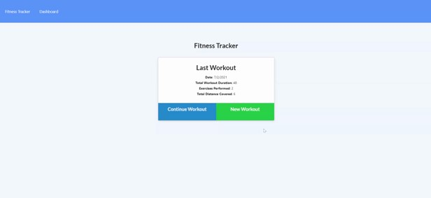

## Fitness-Tracker

This week we were tasked with creating a Fitness Tracker! This way you will be able to record and keep track of all of your workouts in one place.

## How did I do it?

I used the starter code provided to us and built off of it one piece at a time. I created the routes first and then set up the server to get it running.

## Installation

Node.js
Express.js
Mongoose

## Usage

VSCode

## Contributors

Kelsea Hunt
(technically the Bootcamp as well since we had some starter code)

## Picture of the Finished Application

https://k-ryanhunt.github.io/Fitness-Tracker/